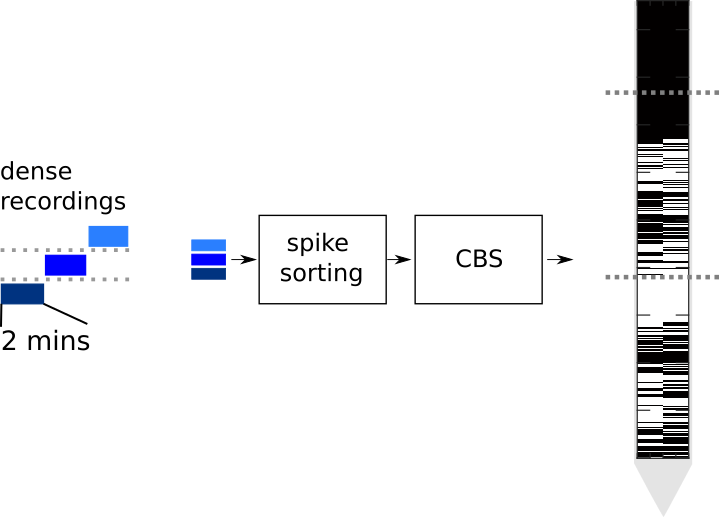
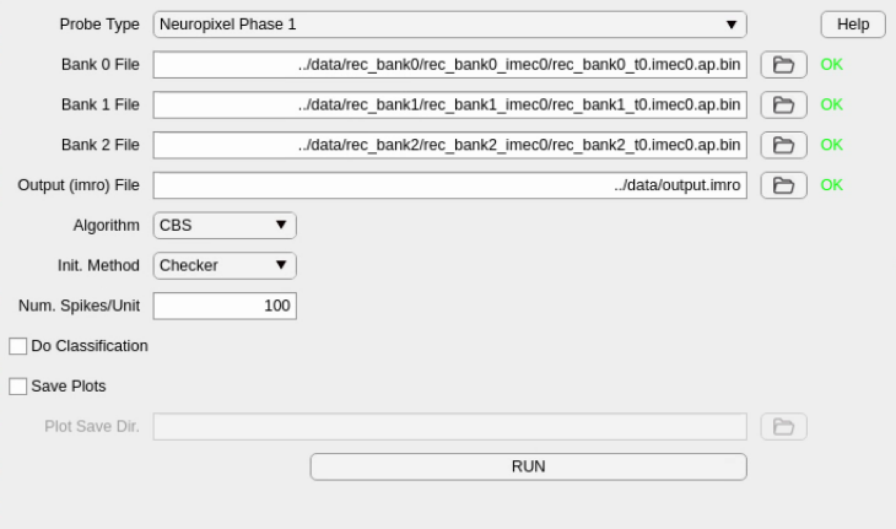
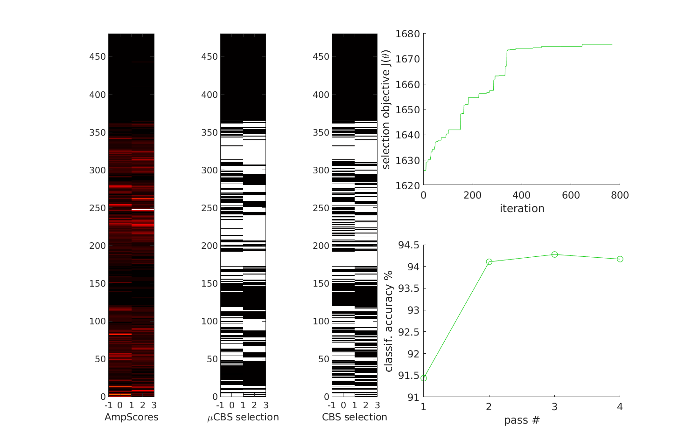
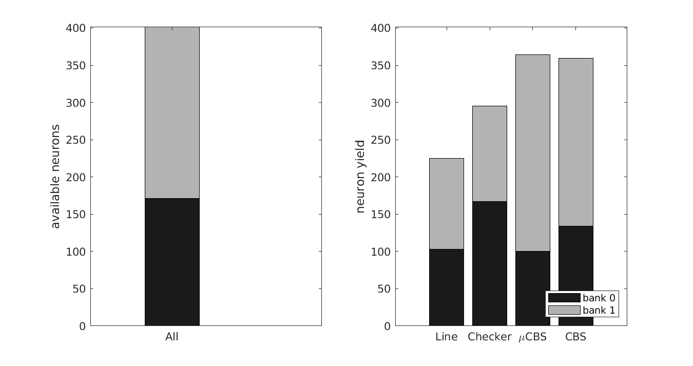
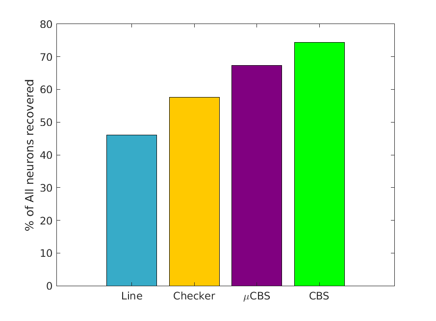
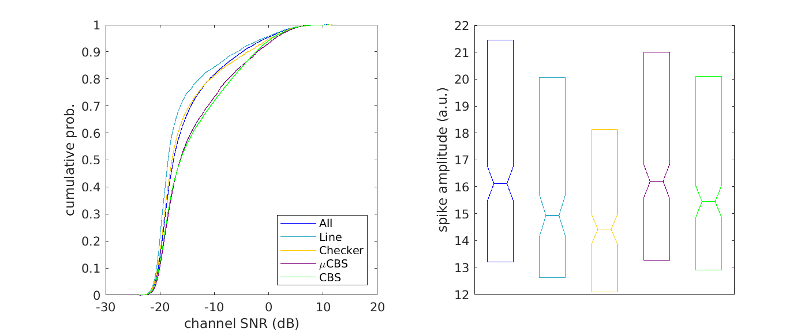
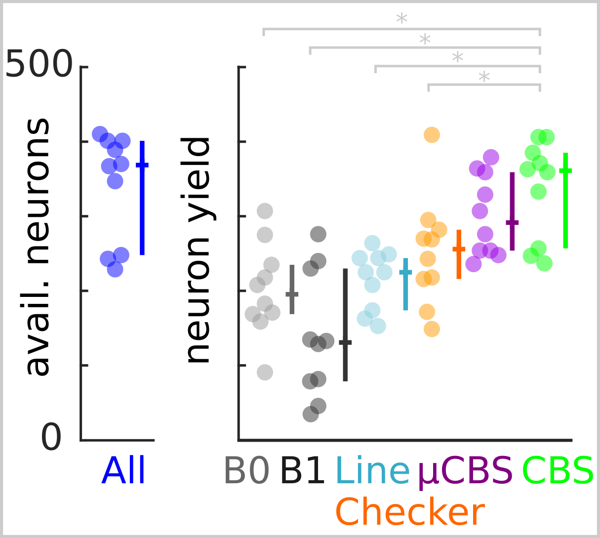

**neuro_cbs**: Optimal Adaptive Electrode Selection to Maximize Simultaneously Recorded Neuron Yield
=

 

**neuro_cbs** provides adaptive Neuropixel (tested on Phase 1) bank/electrode selection to maximize the number of well-isolated neurons. CBS optimizes the selection map using short dense recordings from each bank.

This is the official implementation of "Optimal Adaptive Electrode Selection to Maximize Simultaneously Recorded Neuron Yield."

Included is an implementation of Classification Based Selection (CBS), written in MATLAB.

**Note:** Data for running the following examples is not included as part of this repository (see **Training** below). Instead, we will share this code and experimental data in a runnable containerized environment provided by CodeOcean.

Requirements
-
Neural data is assumed to be collected from a Neuropixel (Imec, Phase 1) using SpikeGLX and sorted by Kilosort2. 

The code depends on the following MATLAB packages. They must be installed and on the MATLAB path:

 - [Kilosort2](https://github.com/MouseLand/Kilosort2)
 - [spikes](https://github.com/cortex-lab/spikes)
 - [npy-matlab](https://github.com/kwikteam/npy-matlab)	

How to use CBS
-
1. First, collect dense bank recordings, 2-3 minutes each. For example, for the Neuropixel Phase 1 probe, collect 3 recordings: one with all channels assigned to bank 0, one with all channels assigned to bank 1, and then one with as many channels as possible assigned to bank 2. For instructions, see [this section](https://github.com/billkarsh/SpikeGLX/blob/master/Markdown/UserManual.md#graphs-window-tools) of the SpikeGLX manual.

2. Spike-sort the dense bank recordings using Kilosort2. The output files from Kilosort2 from each recording should be saved in-place, that is, in the same directory as each recording's binary (`*.ap.bin`) file.

3. You are now ready to run CBS. With this project directory and all dependencies listed above in your MATLAB path, type
```
>> neuro_cbs_gui
```  

This will bring up a GUI window if all dependencies are found. 

First, specify the paths to each of the `*.ap.bin` files in each of the dense bank recordings. Click the folder icon and navigate to the this binary file for each recording. The GUI will check whether the recording is of the correct bank. If it checks out, then an "OK" will appear. 

 [comment]: <> ()

 

Then, specify what file you'd like the output selection map (an `*.imro` file) saved to. 

If the 3 bank binary files and the output `.imro` files are all properly specified, the "Run" button will be clickable. If you want to run CBS with default parameters, you can just click "**Run**." 

You can also adjust the following parameters if you'd like:

 - **Algorithm**: The selection algorithm to use. Available options are CBS and mu-CBS.
 - **Init. Method**: The method to use for initializing the selection map. 
 - **Num. Spikes/Unit**: The number of spikes per unit to use for the selection map. Neurons that spike fewer than this number of times during the recording will be ignored.
 - **Do Classification**: Whether or not to run classification validation. This will quantify the classification accuracy that results from the selection map, evaluated once for the initial map, and then subsequently after every pass through the array (see paper for details). This is not required for CBS to run and will actually slow down the optimization. 
 - **Save Plots, Plot Save Dir**: If you'd like to save the plot output to a directory, then check this option and specify the directory where you'd like to save the image(s) to.

If you'd  prefer to use code instead of a GUI, see `example_train.m` and the "Training" section below for more information.

After you've run CBS, load the `.imro` file generated by CBS into your probe in SpikeGLX. You can do this by right clicking on the waveform window of your probe and clicking on `Edit Banks, Refs, and Gains...`. Then open your `.imro` file.

Training
-
**Note:** The training and testing example scripts below require data that is not distributed along with this repository. A containerized version of this code will be shared through CodeOcean. 

`example_train.m` shows the process of running CBS on one representative recording session. To run the demonstration with parameters used in the paper, start MATLAB, add the required packages to the path, and then type:

```
>> example_train
```

This script loads neural spike data from 2-minute long dense bank recordings made of each of 3 banks on the Neuropixel. It then runs CBS to select a subset of electrodes that maximize a neuron discriminability criterion, denoted as J in the paper.

This script generates:
 - `cbs_results.png`: Figure showing AmpScores across the electrode array and selection maps for CBS and muCBS. The figure also shows the trace of the optimization objective, J, as a function of iteration. Below this is the classification accuracy, which is evaluated at the beginning of optimization and once at the end of every pass through all of the channels.

 [comment]: <> ()

 

 - `cbs_map.imro`: This `.imro` file encodes the selection map found by CBS in a form readable by SpikeGLX recording software.


Evaluation
-
`example_test.m` performs validations from the paper. The script loads full-length subsampled recordings from each selection method and quantifies neuron yield, among other properties. Analyses are performed on one representative session. The test spiking data have been pre-sorted with Kilosort2. To run the analyses, type:
```
>> example_test
```

This script generates:
 - `neuron_yield.png`: In this figure, the left subplot shows the neurons that were detected in dense recordings of banks 0 and 1. On the right, the neuron yields for each of the simultaneous sampling methods are shown. 
 
 [comment]: <> ()

  

 - `neuron_recovery.png`: This plot shows the percentage of available neurons that were recovered by each selection map. To be "recovered," a densely recorded neuron's spike times must be an 80% or better match to a subsampled neuron's spike times.

[comment]: <> (  )

 


 - `channel_snr_and_spike_ampl.png`: The left subplot in this figure shows empirical cumulative distribution functions (CDFs) for channel SNR for each selection method. The right subplot shows spike amplitude distribution for each method. Boxes indicate median with quartiles, and notches show 95% confidence intervals of the median.

[comment]: <> ()


Results
-
The CBS algorithm is able to produce a selection map that would be capable of recording from nearly all units around the probe. This was 41-85% more neurons than would result from using a checkerboard or linear pattern. The figure below shows neuron yields as reported in the paper.

[comment]:<> ( )

 


Questions, Contributing
-
If you have any problems related to installing and running neuro_cbs, please create an "Issue." We would also welcome improvements or extensions. Please feel free to contact us if you would like to contribute.